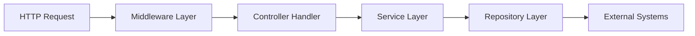
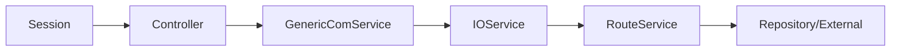
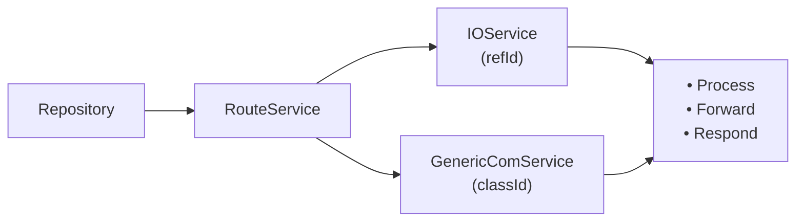

# Backend Architecture Overview

## Architecture Flow

- **HTTP Request**: Incoming request from any client.
- **Middleware Layer**: Central entry point for cross-cutting concerns such as logging, authentication, session creation, and request parsing.
- **Controller Handler**: Receives the request and delegates work to the appropriate service.
- **Service**: Contains business logic, session lifecycle, enforces rules, and side effects.
- **Repository**: Handles communication with resources such as APIs or notification services. 
- **External Systems**: Integrations such as APIs, email, or notification services.  

---

# Message Cycle Documentation

## Overview
The system handles messages through a structured cycle, supporting both **sending requests** from clients and **receiving responses** from repositories or external services.  
The flow ensures that messages are properly constructed, routed, observed, and dispatched to the relevant handlers or clients.  

## 1. Sending a Message (Client → Controller → Repositories)

When a client sends a request via a controller, the message goes through the following services:

### 1.1 Controller Handler
- Receives the client request.
- Passes the request to `GenericComService`.

### 1.2 GenericComService
- Constructs the **Header** and **Body** of the message.
- Adds an **emitter** for the corresponding `classId`.
- Passes the message to `IOService`.

### 1.3 IOService
- Assigns a **refId** to the message.
- Registers **observers** for the `refId` to handle asynchronous replies.
- Forwards the message to `RouteService`.

### 1.4 RouteService
- Determines the appropriate destination for the message:
  - External API
  - External WebSocket
  - Other internal repositories
- Sends the message to the chosen repository.

**Flow Diagram:**

## 2. Receiving a Message (Repository → RouteService → Handlers/Client)

When a reply is received from any repository, the flow depends on whether the message has a `refId`:

### 2.1 RouteService
- Receives the message from the repository.
- Checks if the message contains a `refId`.

### 2.2 If Message Contains `refId`
- Passes the message to `IOService`.
- `IOService` dispatches the message to the subscribed callback corresponding to the `refId`.

### 2.3 If Message Does Not Contain `refId`
- Emits the message to the listener registered on `GenericComService` for the corresponding `classId`.

### 2.4 Post-processing
- The reply may trigger one or more actions:
  - Forward to another repository (following the sending cycle).
  - Process internally in the API.
  - Send a response to the frontend/client session.

**Flow Diagram:**

---

## 3. Notes and Key Concepts
- **refId**: Unique identifier to track request-reply pairs.
- **classId**: Identifier to group message types or categories.
- **Observers/Emitters**: Mechanism to asynchronously handle replies.
- **RouteService**: Central hub to determine routing to the correct repository or external service.
- The system supports **internal processing**, **cross-repository forwarding**, and **client responses** seamlessly.

---