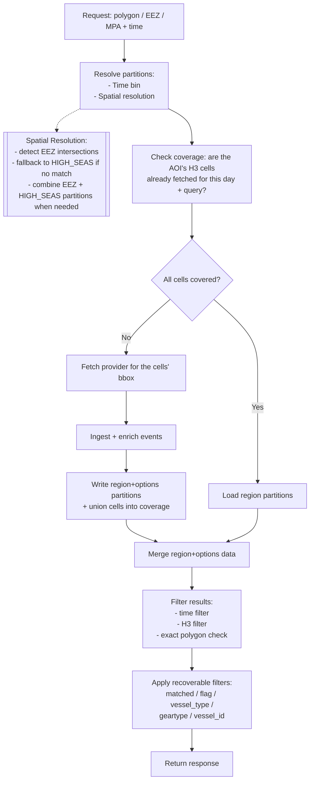

# Serving Strategy

## Overview

The system stores vessel event data in Parquet files and serves them through a simple read-optimized API.

The core is a single component:

- **API service**: resolves the query to partitions, reads those Parquet files, and returns results — fetching, enriching, and storing on a cache miss.

The API does not normally call the provider, except when coverage is missing (cache-on-miss). **Ingestion is on-demand**: a request that misses populates the partitions it needs. There is no separate scheduled ingestion worker today — see [Ingestion](#ingestion-on-demand-today).

### Module map

| Concern | Module |
|---|---|
| Pure helpers (date range, query key, dedup, time filter, coverage logic) | `helpers/utils/servingUtils.ts` |
| Spatial logic (AOI → partition resolution, per-event routing, H3 + exact-polygon filters) | `helpers/geo/spatial.ts` |
| Orchestration (resolve → coverage → cache-on-miss → filter → sort) | `services/ServingService.ts` |
| Serving **repository** (partition Parquet read/write + coverage manifest), behind `IServingRepository` + a config-selectable factory | `repositories/serving/` (`IServingRepository` in `helpers/types/serviceTypes.ts`) |
| Detection service: fetch → normalise → enrich on miss (+ dev fixture fallback) | `services/DetectionService.ts` |
| Detection **repository** (raw provider fetch), behind `IDetectionRepository` + a config-selectable factory | `repositories/detection/` (`GfwDetectionRepository`; `IDetectionRepository` in `helpers/types/serviceTypes.ts`) |

---

# What is stored in a partition

Each partition file is a Parquet file of canonical events. Each row has just two
columns: `event_id` (an inspectable primary/dedup key) and `canonical_json` (the
full `IEventSchema` serialized to a string). The read path returns complete
events by parsing `canonical_json`, and filtering (time / H3 / polygon) runs on
those reconstructed objects.

> Extra scalar columns for **predicate pushdown** (filtering on `timestamp` /
> `lat` / `lon` / `h3_cell` *before* parsing the JSON) are intentionally omitted
> for now — at pilot scale we parse every row. Adding them is the documented
> scale optimization (see [Future improvements](#future-improvements)).

> This is deliberately **separate** from the analyst-facing export schema in
> `helpers/types/parquetTypes.ts`, which is intentionally flat/lossy (CSV-like
> columns for the evidence bundle). The serving store must round-trip full
> fidelity; the export store must stay human-legible.

---

# How data is stored

Data is stored per **day**, then per **fetch options signature** (see
[Partition fetch options](#partition-fetch-options) below), then split into:

- EEZ-based files
- ONE HIGH_SEAS file per day + options (fallback bucket)

### Example structure

```
events/
  date=2026-05-26/
    8444/opts=3f1a9c0e2b7d.parquet
    8812/opts=3f1a9c0e2b7d.parquet
    HIGH_SEAS/opts=3f1a9c0e2b7d.parquet
```

> `opts=3f1a9c0e2b7d` is the default/most-common signature (default dataset
> selection, resolution, and aggregation settings, no `distance_from_port_km` /
> `neural_vessel_type` / `speed` filter) — every request that doesn't change
> one of the [partition fetch options](#partition-fetch-options) shares this
> one path, so the common case's layout looks the same as before this
> dimension existed. A request that *does* change one of them — including
> just switching `temporal-resolution` from HOURLY to DAILY — gets its own
> sibling directory instead of sharing — or corrupting — this one.

---

# What is HIGH_SEAS?

HIGH_SEAS contains all events that are outside any EEZ.

It is:

- created on the first request whose data falls outside any EEZ
- shared for the whole day
- updated when new missing data is fetched

It is NOT created per request.

---

# Ingestion (on-demand today)

Ingestion is **lazy / cache-on-miss**, not a scheduled background job. When a
request misses, the serving path itself ingests the data it needs, in one pass
(`services/ServingService.ts` → `services/DetectionService.ts` → `repositories/detection` → GFW):

1. Call the provider once for the requested window.
2. Enrich events (EEZ, H3, scoring, metadata).
3. Route each event to its `(day, partition)` bucket and merge + dedup into the
   partition file.
4. Record coverage so a repeat of the same query is a pure cache hit.

A **scheduled ingestion worker** that proactively pre-warms partitions
(per-EEZ, on a timer) is a deliberate *future* improvement, not part of the
as-built system — see [Future improvements](#future-improvements). It would
reuse the same `writePartition` / coverage code behind a CLI + scheduler.

> Note: the offline pipeline (`pipeline:sample`, `src/pipeline/sample.ts`) is a
> separate concern — it produces evidence bundles under `data/out/`, and does
> **not** write to the `data/events/` partition cache.

---

# API serving flow

When a user sends a request:

## Step 1 - Find region

- Check which EEZ overlaps the polygon
- If none then use HIGH_SEAS

---

## Step 2 - Load files ( if applicable )

Examples:

```
events/date=2026-05-26/8444.parquet
events/date=2026-05-26/HIGH_SEAS.parquet
```

---

## Step 3 - Filter data

After loading and merging the resolved partitions, filtering is applied in this
order (the result is identical regardless of order; the order is chosen so the
cheap steps prune first):

1. **time** - keep events inside the requested `date-range`.
2. **H3 (coarse)** - keep events whose serving-resolution H3 cell falls in the
   AOI cell set. The cell set is the polygon's cells **expanded by one ring**
   (`gridDisk(k=1)`), so this step never drops a valid edge event before the
   exact check runs. It is skipped when the AOI is smaller than a single cell.
3. **exact polygon** - authoritative point-in-polygon test against the AOI.

---

## Step 4 - Missing data ( cache-on-miss behavior )

Coverage is tracked in a **coverage manifest** (`data/events/coverage.json`) by
**area, not by request shape**. Its structure is `date → queryKey → covered H3
cells`:

- The **queryKey** is the *non-spatial, non-temporal* shape of the request —
  URL, method, and its [partition fetch options](#partition-fetch-options)
  (dataset selection; `distance_from_port_km`/`neural_vessel_type`/`speed`;
  and `spatial-resolution`/`temporal-resolution`/`spatial-aggregation`/
  `group-by`/`format`). It **excludes** `date-range` (the day is the partition dimension), **all
  geometry** (the spatial dimension is the cell set), and — deliberately — the
  *recoverable* `filters[i]` predicates (`matched`, `flag`, `vessel_type`,
  `geartype`, `vessel_id`; see below). So a different map box, or a request
  that only changes one of those recoverable predicates, resolves to the same
  queryKey.
- The **covered cells** are the H3 cells (at a coarse coverage resolution) that
  have actually been fetched for that day + queryKey.

A day is **covered** for a request when *every* cell its AOI needs is already in
the set — i.e. the AOI's cells are a **subset** of what's been fetched. This is
what makes **zooming in a cache hit**: a smaller box inside an already-fetched
box needs only cells we already have.

On a miss (any requested day whose cells aren't all covered):

1. **Align the fetch to the cells' bounding box** and call the provider **once**
   for the whole window. Fetching the cell-bbox (⊇ the cells we'll mark)
   guarantees every covered cell is *fully* fetched — so a later subset query
   can be served from cache without losing events at cell edges. The
   recoverable `filters[i]` predicates are stripped out of this call first
   (`sanitizeFetchUrlParams`) — see [Partition fetch options](#partition-fetch-options).
2. Process and enrich events.
3. Route each event to its `(day, region, options)` partition file (`region =
   its EEZ MRGID`, else `HIGH_SEAS`; `options` = the fetch options signature)
   and **merge + dedup**.
4. **Union the AOI's cells** into the coverage set for each missed day —
   including days that came back empty, so a repeat is a hit, not a re-fetch.
5. Read the partitions back, apply the recoverable predicates
   (`applyRecoverableEventFilters`), filter, and return.

A second identical **or zoomed-in** request finds its cells covered and is a
**pure cache hit** (no provider call). The hit/miss outcome is logged; surfacing
it in the response payload is owned by the response-cache work (master-plan 2.2).

> Region partitions (files) and coverage (cells) are **separate dimensions**:
> regions decide *which file* an event is stored in/read from; cells decide
> *whether we need to fetch*. That separation is what lets zoom-in hit the cache
> without changing the file layout.

---

# Partition fetch options

`filters[i]` on a request can carry two very different kinds of predicate, and
conflating them was a real bug: a request that only changed
`matched`/`unmatched` was forcing an unnecessary re-fetch, and — because the
partition file was keyed only by `(day, region)` — a narrower fetch's rows
would merge into the same shared file a broader query had already populated,
after which every future read of that file (any filter, cache hit or miss)
returned the merged union with no way to narrow it back down.

The fix splits `filters[i]`/`datasets[i]` into two disjoint sets, backed by two
backend-only types in `helpers/types/servingTypes.ts`:

- **`IPartitionFetchOptions`** — values that genuinely scope *what the
  provider is asked for*, in two different ways:
  - `datasets[i]` and `filters[i]`'s `distance_from_port_km` /
    `neural_vessel_type` / `speed` narrow *which rows* come back from the same
    grid, and we don't (or, for `speed`/`distance_from_port_km`, can't — they
    belong to the fishing-effort / AIS-presence datasets, not `IEventSchema`)
    persist them per cached event.
  - The plain top-level `url_params` `spatial-resolution`,
    `temporal-resolution`, `spatial-aggregation`, `group-by`, and `format`
    change the grid/aggregation/encoding itself (e.g. DAILY vs HOURLY bins) —
    a result fetched under one combination can't be reinterpreted as another
    after the fact, so these can't be dropped from the key either even though
    they aren't `filters[i]`/`datasets[i]` at all.

  These **must** both reach the provider on a miss-fetch and key the
  partition — coverage manifest *and* physical file — computed by
  `partitionFetchOptions()` / `partitionOptionsSignature()` in
  `servingUtils.ts`. Two requests whose options differ are always treated as a
  hard miss against each other — there's no general subset relationship the
  way there is for AOI cells (a future refinement could add one specifically
  for numeric thresholds like `distance_from_port_km`, but that isn't
  implemented).
- **`IRecoverableEventFilters`** (`matched`, `flag`, `vessel_type`, `geartype`,
  `vessel_id`) — values that ARE recoverable from a cached raw event
  afterward: `matched` from `IEventSchema.matched_flag`, the rest from
  `IEventSchema.raw_metadata` (the provider's original entry, preserved
  verbatim). These are deliberately excluded from the queryKey and from the
  partition path, stripped out of the miss-fetch request
  (`sanitizeFetchUrlParams()`), and enforced instead at read time
  (`applyRecoverableEventFilters()`, called from `eventsController` right
  alongside `applyFilter`) — uniformly, regardless of whether the response
  came from a cache hit or a fresh fetch.

In short: **the partition always holds the full raw set for its
`IPartitionFetchOptions`; every `IRecoverableEventFilters` predicate is a
read-time view over that raw set, never a reason to fetch less or to fork the
file.** This applies to the `cache: "enabled"` path only — `cache: "disabled"`
is unaffected: it already forwards every `filters[i]` predicate straight to
the provider on every request, with no shared partition at risk.

---

# Deduplication rule

Every write into a partition (most importantly the shared, growing
`HIGH_SEAS` file) is **deduplicated by `event_id`** - the deterministic
SHA-256 of `timestamp + lon + lat + source`. `writePartition` reads the
existing file, concatenates the new rows, keeps one row per `event_id`, sorts by
`event_id`, and rewrites the file (parquetjs cannot append in place). This makes
overlapping/repeated fetches idempotent and keeps partition files from
accumulating duplicates at pilot scale.

---

# Multiple request behavior

If another request comes for the same day (same or overlapping area) **with
the same [partition fetch options](#partition-fetch-options)**:

- the system reuses the existing region Parquet files,
- only calls the provider when the AOI needs a cell not yet covered,
- merges any newly fetched data into the region files, deduped by `event_id`,
  and unions the new cells into coverage.

A request that only changes a *recoverable* filter (`matched`, `flag`,
`vessel_type`, `geartype`, `vessel_id`) is included in "same options" above —
it reuses the same files and is narrowed at read time instead. A request that
changes `distance_from_port_km` / `neural_vessel_type` / `speed` / dataset
selection gets its own sibling files under a different `opts=` signature.

---

# Why this design works

- Simple storage layout
- No explosion of files
- Fast reads for most queries
- Works for both EEZ and open ocean
- Supports incremental caching

---

# Limitations

- First request for an area/day may be slower (provider fetch + enrich + write).
- The `HIGH_SEAS` file grows over time. Duplicate rows are prevented by the
  `event_id` dedup rule above, but the file is still rewritten in full on each
  merge - fine at pilot scale, not at operational scale.
- **Coverage granularity is the coarse H3 cell.** A new box is a hit only when
  all of its cells were previously fetched. Nested/overlapping boxes hit; a box
  that pokes one cell beyond what's been fetched re-fetches (the dedup rule keeps
  that correct, just not free).
- **The miss-fetch over-fetches to the cell bounding box.** For a thin or
  diagonal AOI the cells' bbox can be noticeably larger than the AOI, so the
  provider call pulls more than strictly needed (deduped on write). Fine for the
  compact AOIs at pilot scale.
- **Partition fetch options match exactly, with no subset reasoning.** Unlike
  AOI cells, a request for `distance_from_port_km: 2` gets its own partition
  even though `distance_from_port_km: 1` (say) would satisfy it too — there's
  no general containment relationship implemented across arbitrary
  `IPartitionFetchOptions` combinations. Every distinct combination that's
  actually used gets its own partition family under the day directory.

---

# Future improvements

- Add predicate-pushdown columns to the serving schema (`timestamp`, `lat`,
  `lon`, `h3_cell`) and filter on them — projecting columns on read — so large
  partitions don't parse every row's `canonical_json`.
- Tighten the miss-fetch from the cell bbox toward the exact cell set (fewer
  over-fetched events for thin/diagonal AOIs).
- Background prefetching for hot areas; partition-file compaction for `HIGH_SEAS`.
- Move to a lakehouse system (Iceberg/Delta) with a scheduled ingestion worker.
- Subset reasoning for monotonic `IPartitionFetchOptions` fields — e.g. a
  request for `distance_from_port_km >= 20` could be served from a partition
  already fetched at `>= 10` — if fragmentation from that field turns out to
  matter in practice.

---

# Diagram



> "Region partitions" above is shorthand for `(day, region, options)` — see
> [Partition fetch options](#partition-fetch-options).

---

# Summary

Data is stored per day, per fetch-options signature, and split into:

- EEZ partitions
- ONE HIGH_SEAS fallback partition

H3 is used in two places: a coarse read-time filter prune, and (at a coarser
resolution) the coverage manifest that decides hit vs. fetch by area.

The system learns and grows its cache based on usage — and because coverage is
tracked by area (cells) and [fetch options](#partition-fetch-options),
zooming into an already-fetched region, or changing only a recoverable filter
(matched/flag/vessel_type/geartype/vessel_id), is a cache hit.
