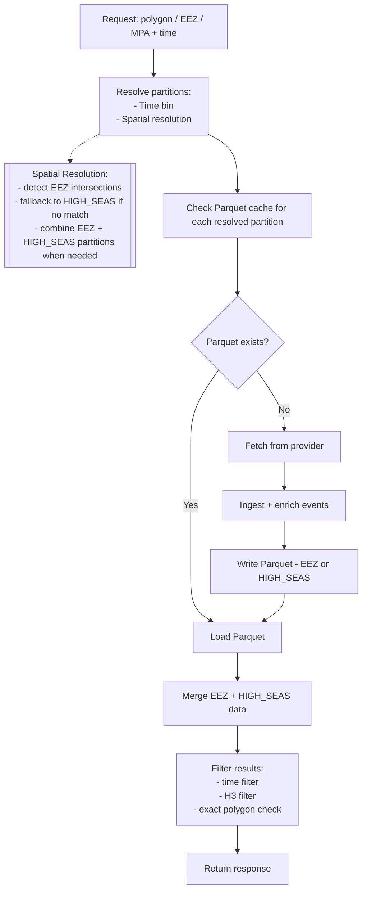

# Serving Strategy

## Overview

The system stores vessel event data in Parquet files and serves them through a simple read-optimized API.

There are two main components:

* **Ingestion worker** → fetches data from the provider and stores it
* **API service** → reads Parquet files and returns results

The API does not normally call the provider, except when data is missing.


---

# How data is stored

Data is stored per **day** and split into:

* EEZ-based files
* ONE HIGH_SEAS file per day (fallback bucket)

### Example structure

```
events/
  date=2026-05-26/
    8444.parquet
    8812.parquet
    HIGH_SEAS.parquet
```

---

# What is HIGH_SEAS?

HIGH_SEAS contains all events that are outside any EEZ.

It is:

* created during ingestion OR first fallback request
* shared for the whole day
* updated when new missing data is fetched

It is NOT created per request.

---

# Ingestion worker

The worker runs periodically and:

1. Reads EEZ polygons
2. Picks a time window
3. Calls the provider per EEZ
4. Enriches events (EEZ, H3, scoring, metadata)
5. Writes events into EEZ or HIGH_SEAS Parquet files

---

## Ingestion rules

### If EEZ match exists:

```
→ write to eez_id.parquet
```

### If no EEZ match:

```
→ write to HIGH_SEAS.parquet
```

---

# API serving flow

When a user sends a request:

## Step 1 — Find region

* Check which EEZ overlaps the polygon
* If none → use HIGH_SEAS

---

## Step 2 — Load files

Examples:

```
events/date=2026-05-26/8444.parquet
events/date=2026-05-26/HIGH_SEAS.parquet
```

---

## Step 3 — Filter data

After loading Parquet:

* filter by polygon
* filter by H3 cells
* filter by time range

---

## Step 4 — Missing data

If required data is not available:

1. Call the provider
2. Process and enrich events
3. Add to the correct file (EEZ or HIGH_SEAS)
4. Return result

This is a cache-on-miss behavior.

---

# Multiple request behavior

If another request comes for HIGH_SEAS (same day):

* system reuses existing HIGH_SEAS.parquet
* only calls provider if missing spatial coverage
* merges new data into the same file

---

# Why this design works

* Simple storage layout
* No explosion of files
* Fast reads for most queries
* Works for both EEZ and open ocean
* Supports incremental caching

---

# Limitations

* First request for a region may be slower
* HIGH_SEAS file grows over time
* Requires deduplication strategy in future

---

# Future improvements

* Smarter caching strategy for HIGH_SEAS
* Select EEZ IDs based on user location (polygon intersection)
* Background prefetching for hot areas
* Move to lakehouse system (Iceberg/Delta)

---
# Diagram




---

# Summary

Data is stored per day and split into:

* EEZ partitions
* ONE HIGH_SEAS fallback partition

H3 is only used inside files for filtering.

The system learns and grows its cache based on usage.
